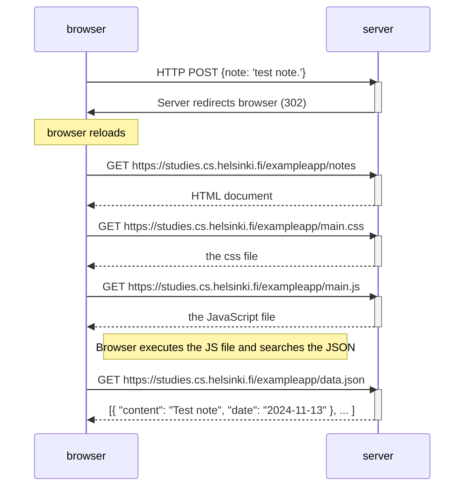

```mermaid
sequenceDiagram
participant browser
participant server
    browser->>server: HTTP POST {note: 'test note.'}
    activate server
    server->>browser: Server redirects browser (302)
    deactivate server
    
    note over browser: browser reloads
     browser->>server: GET https://studies.cs.helsinki.fi/exampleapp/notes
    activate server
    server-->>browser: HTML document
    deactivate server

    browser->>server: GET https://studies.cs.helsinki.fi/exampleapp/main.css
    activate server
    server-->>browser: the css file
    deactivate server

    browser->>server: GET https://studies.cs.helsinki.fi/exampleapp/main.js
    activate server
    server-->>browser: the JavaScript file
    deactivate server

    Note right of browser: Browser executes the JS file and searches the JSON

    browser->>server: GET https://studies.cs.helsinki.fi/exampleapp/data.json
    activate server
    server-->>browser: [{ "content": "Test note", "date": "2024-11-13" }, ... ]
    deactivate server

```
